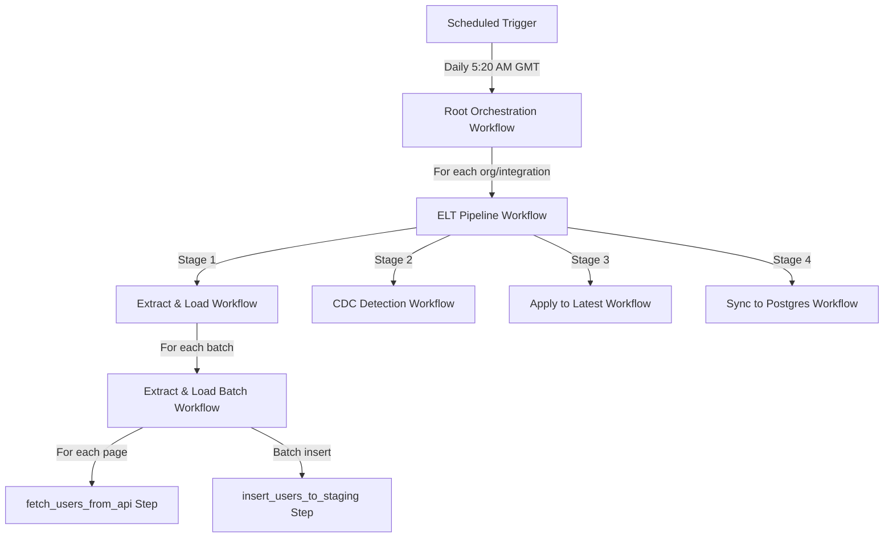
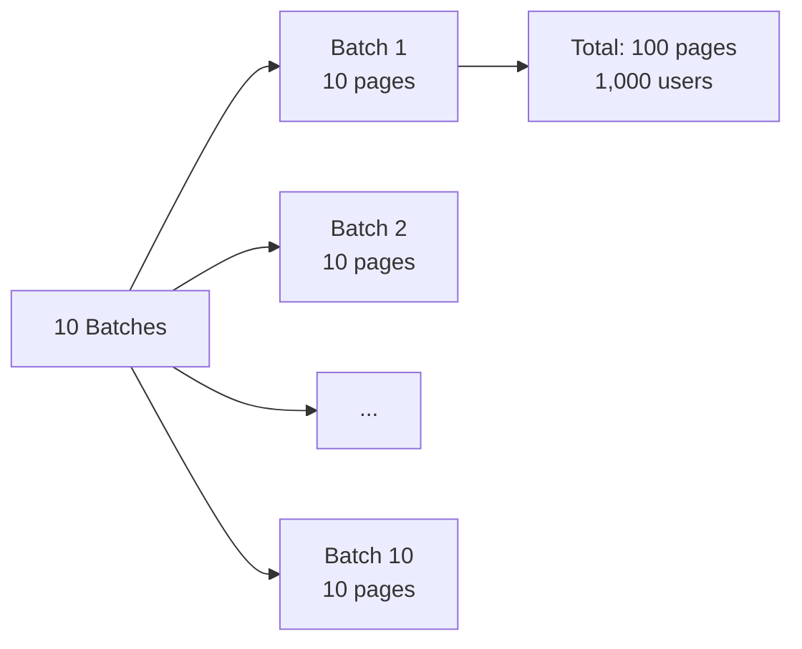
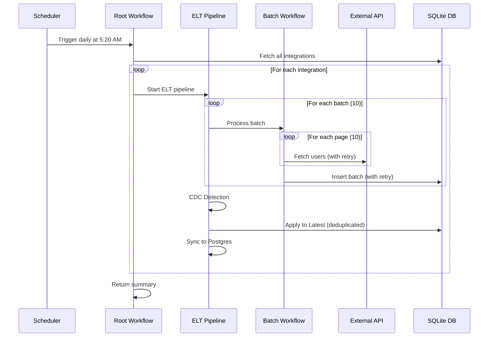

# ELT Pipeline Architecture

## Overview

This document describes the architecture of a distributed ELT (Extract, Load, Transform) pipeline built with DBOS workflows. The system processes users from multiple external APIs across different organizations and integrations, with built-in resilience to failures, memory management, and data deduplication.

## Workflow Chain Architecture

The pipeline uses a hierarchical workflow structure with four levels:



### Workflow Hierarchy

1. **Scheduled Trigger** (`scheduled_elt_trigger`)
   - Runs daily at 5:20 AM GMT
   - Starts the root orchestration workflow in the background
   - Returns the workflow ID for tracking

2. **Root Orchestration** (`root_orchestration_workflow`)
   - Fetches all connected integrations from the database
   - Launches an ELT pipeline for each org/integration pair
   - Aggregates results and provides summary statistics
   - Max recovery attempts: 50

3. **ELT Pipeline** (`elt_pipeline_workflow`)
   - Orchestrates the four sequential stages for a single org/integration pair:
     - **Stage 1**: Extract and Load
     - **Stage 2**: CDC (Change Data Capture) Detection
     - **Stage 3**: Apply changes to Latest table
     - **Stage 4**: Sync to Postgres main database
   - Max recovery attempts: 100

4. **Sub-Workflows**:
   - **Extract & Load Workflow** (`extract_and_load_workflow`): Processes data in batches
   - **Extract & Load Batch Workflow** (`extract_and_load_batch_workflow`): Processes a single batch
   - **CDC Detection** (`detect_changes_workflow`): Mock workflow for change detection
   - **Apply to Latest** (`apply_changes_to_latest_workflow`): Uses window function for deduplication
   - **Sync to Postgres** (`sync_to_postgres_workflow`): Mock workflow for final sync

## Batching Strategy

### Memory-Efficient Data Fetching

To prevent Out-of-Memory (OOM) errors when processing large datasets, the pipeline implements a **two-level batching approach**:



### Batch Configuration

- **Default**: 10 batches × 10 pages per batch = 100 total pages
- **Page size**: 10 users per page
- **Total default**: 1,000 users per org/integration pair

### How It Works

1. **Batch-Level Processing** (`extract_and_load_workflow`):
   - Iterates through N batches (default: 10)
   - Each batch is processed by a separate sub-workflow
   - After processing batch 5, includes 5% random OOM simulation for testing resilience

2. **Page-Level Processing** (`extract_and_load_batch_workflow`):
   - Within each batch, fetches M pages (default: 10)
   - Accumulates users from all pages in memory
   - Performs a single batch insert to the database
   - Releases memory after insertion

### Benefits

- **Memory Control**: Only one batch (10 pages = 100 users) in memory at a time
- **Failure Isolation**: If a batch fails, only that batch needs to retry
- **Progress Tracking**: Each batch is a durable checkpoint
- **Scalability**: Easy to adjust batch/page size based on available memory

## Scheduled Workflows

The pipeline uses DBOS scheduled workflows for automated execution:

```python
@DBOS.scheduled("20 5 * * *")  # Cron syntax: minute hour day month dayOfWeek
@DBOS.workflow()
def scheduled_elt_trigger(scheduled_time, actual_time):
    # Starts root orchestration workflow daily at 5:20 AM GMT
```

### Schedule Details

- **Frequency**: Daily
- **Time**: 5:20 AM GMT
- **Trigger Method**: `DBOS.start_workflow()` (non-blocking)
- **Resilience**: If the system is down, the workflow will run when it comes back online

## Data Deduplication

### The Problem

Due to DBOS's automatic retry mechanism, the same users may be inserted multiple times:
- Step retries when `insert_users_to_staging` fails after insertion
- Workflow recovery when crashes occur mid-batch

### The Solution: SQL Window Function

The `get_unique_user_count()` function uses a window function to deduplicate records:

```sql
WITH ranked_users AS (
    SELECT 
        id,
        workflow_id,
        organization_id,
        connected_integration_id,
        created_at,
        ROW_NUMBER() OVER (
            PARTITION BY id, workflow_id, organization_id, connected_integration_id
            ORDER BY created_at DESC
        ) as rn
    FROM users
    WHERE <filters>
)
SELECT COUNT(*)
FROM ranked_users
WHERE rn = 1
```

### How It Works

1. **PARTITION BY id, workflow_id**: Groups records by user, workflow, organization, and integration. Note that the `id` is unique and is generated from the external API `id`.
2. **ORDER BY created_at DESC**: Sorts duplicates with newest first
3. **ROW_NUMBER()**: Assigns rank 1 to the most recent record
4. **WHERE rn = 1**: Selects only the latest version

### Key Features

- Handles duplicates from both step retries and workflow recoveries
- Preserves the most recent version of each user
- Efficient counting without materializing duplicate records
- Works across different workflow runs

## Failure Handling

### Simulated Failures

The pipeline includes intentional failure simulation for testing resilience:

| Failure Type | Location | Probability | Recovery |
|--------------|----------|-------------|----------|
| API Failure | `fetch_users_from_api` | 2% | Auto-retry up to 3 attempts |
| DB Insertion Failure | `insert_users_to_staging` | 40% | Auto-retry up to 10 attempts with exponential backoff |
| OOM Error | `extract_and_load_workflow` | 5% (after batch 5) | Workflow recovery from last checkpoint |

### Retry Configuration

```python
# API Step: 3 retries with default backoff
@DBOS.step(retries_allowed=True, max_attempts=3)

# Database Step: 10 retries with fast backoff
@DBOS.step(retries_allowed=True, max_attempts=10, backoff_rate=0.1, interval_seconds=0.1)

# Workflow: Up to 100 recovery attempts
@DBOS.workflow(max_recovery_attempts=100)
```

## External Triggering

The pipeline can be triggered externally via DBOS queues:

```python
elt_queue = Queue("elt_queue", concurrency=5)

# Remote clients can enqueue workflows using DBOSClient
# Queue ensures max 5 concurrent executions
```

## Data Flow



## Key Design Decisions

1. **Hierarchical Workflows**: Enables fine-grained recovery and progress tracking
2. **Two-Level Batching**: Balances memory usage with API efficiency
3. **Window Functions**: Elegant SQL-based deduplication without application logic
4. **Scheduled Execution**: Ensures daily data synchronization
5. **Resilient Steps**: Automatic retries handle transient failures
6. **Queue Support**: Allows external systems to trigger pipelines
7. **One HTTP Request Per Step**: Each API call is a separate retriable step

## Step Granularity: One HTTP Request Per Step

### Design Decision

This pipeline uses **one HTTP request per DBOS step** rather than batching multiple HTTP requests within a single step. While this approach adds some overhead (~21-24ms per step based on [experiment 15](../exp15/)), it provides significant resilience benefits.

### Why This Approach?

```python
# ✅ Current approach: One request per step
@DBOS.step(retries_allowed=True, max_attempts=3)
def fetch_users_from_api(organization_id: str, integration_id: UUID, page: int):
    # Single HTTP request
    return api_client.get_users(page)

# ❌ Alternative: Multiple requests in one step
@DBOS.step(retries_allowed=True, max_attempts=3)
def fetch_all_users(organization_id: str, integration_id: UUID, pages: list):
    results = []
    for page in pages:  # If this fails mid-loop, all progress is lost
        results.extend(api_client.get_users(page))
    return results
```

### Benefits

1. **Fine-Grained Retry Logic**
   - If one API call fails, only that specific call is retried
   - Already-fetched pages are not re-fetched
   - Reduces redundant API calls and load on external services

2. **Better Failure Isolation**
   - HTTP errors only affect the current page fetch
   - Other pages in the batch continue successfully
   - Network timeouts don't invalidate entire batches

3. **Progress Tracking**
   - Each completed step is a durable checkpoint
   - Can monitor exactly which pages have been fetched
   - Enables precise observability and debugging

4. **Acceptable Overhead**
   - Per-step overhead is ~21-24ms for small payloads (< 10 KB)
   - Total overhead for 10 pages: ~240ms
   - This is negligible compared to actual API call latency (typically 100-500ms)

### Performance Comparison

Based on **experiment 15** (`exp15/ex1.py`), which compared multiple small steps vs. single batched step:

| Metric | Multiple Steps | Batched Step | Notes |
|--------|---------------|--------------|-------|
| **Overhead per step** | ~21-24ms | N/A | Steady-state overhead |
| **First step overhead** | ~55ms | ~55ms | Initialization cost |
| **Small payloads (< 10 KB)** | ~21-24ms | Shared across batch | Consistent performance |
| **Retry efficiency** | Only failed step | Entire batch | Key advantage |
| **Progress visibility** | Per-step | End-to-end only | Better observability |

### Real-World Impact

In this ELT pipeline:
- **10 pages per batch** × **21-24ms overhead** = **~240ms total overhead**
- **Typical API latency**: 100-500ms per request
- **Overhead as % of total time**: ~10-20%
- **Benefit**: 2% API failure rate → only 1 retry instead of retrying all 10 pages

### Trade-offs

**Advantages:**
- ✅ Retry only failed requests (saves API quota and time)
- ✅ Better fault isolation
- ✅ Precise progress tracking
- ✅ Easier debugging (know exactly which page failed)

**Disadvantages:**
- ⚠️ ~21-24ms overhead per API call
- ⚠️ More database writes (one per step)
- ⚠️ Slightly longer workflow execution time

### When to Use Each Approach

**Use one-request-per-step (current approach) when:**
- External APIs are unreliable or rate-limited
- Progress tracking and observability are important
- Retry efficiency matters (avoid redundant work)
- Per-request overhead (< 25ms) is acceptable

**Use batched-requests-in-step when:**
- APIs are extremely reliable (< 0.1% failure rate)
- Absolute performance is critical
- All-or-nothing processing is acceptable
- Overhead reduction > 40% is needed (see exp15 results)
