# ELT Pipeline Architecture

## Overview

This document describes the architecture of a distributed ELT (Extract, Load, Transform) pipeline built with DBOS workflows. The system processes users from multiple external APIs across different organizations and integrations, with built-in resilience to failures, memory management, and data deduplication.

## Workflow Chain Architecture

The pipeline uses a hierarchical workflow structure with four levels:

```mermaid
graph TD
    A[⏰ Scheduled Trigger<br/>scheduled_elt_trigger] -->|Daily 5:20 AM GMT| B[🌟 Root Orchestration Workflow<br/>root_orchestration_workflow]
    B -->|For each org/integration| C[🚀 ELT Pipeline Workflow<br/>elt_pipeline_workflow]
    C -->|🔷 Stage 1| D[🎯 Extract & Load Workflow<br/>extract_and_load_workflow]
    C -->|🔷 Stage 2| E[🔎 CDC Detection Workflow<br/>detect_changes_workflow]
    C -->|🔷 Stage 3| F[▶️ Apply to Latest Workflow<br/>apply_changes_to_latest_workflow]
    C -->|🔷 Stage 4| G[🔄 Sync to Postgres Workflow<br/>sync_to_postgres_workflow]
    D -->|For each batch 1-10| H[📦 Extract & Load Batch Workflow<br/>extract_and_load_batch_workflow]
    H -->|For each page 1-10| I[📡 fetch_users_from_api<br/>Step with retry]
    H -->|Batch insert| J[💾 insert_users_to_staging<br/>Step with retry]
    E -->|Calls| K[🔍 detect_changes_step<br/>Step - detects INSERT/UPDATE/DELETE]
    F -->|Calls| L[⚡ apply_changes_step<br/>Step - applies CDC to latest]
    G -->|Calls| M[📥 get_cdc_changes_step<br/>Step - retrieves CDC records]
```



### Workflow Hierarchy

1. **⏰ Scheduled Trigger** (`scheduled_elt_trigger`)
   - Runs daily at 5:20 AM GMT using `@DBOS.scheduled("20 5 * * *")`
   - Starts the root orchestration workflow in the background via `DBOS.start_workflow()`
   - Returns the workflow ID for tracking
   - Max recovery attempts: 10

2. **🌟 Root Orchestration** (`root_orchestration_workflow`)
   - Fetches all connected integrations from the database
   - Launches an ELT pipeline synchronously for each org/integration pair
   - Aggregates results and provides summary statistics (total integrations, total users)
   - Max recovery attempts: 10

3. **🚀 ELT Pipeline** (`elt_pipeline_workflow`)
   - Orchestrates the four sequential stages for a single org/integration pair:
     - **🔷 Stage 1**: Extract and Load (fetches 1000 users by default)
     - **🔷 Stage 2**: CDC (Change Data Capture) Detection (detects INSERT/UPDATE/DELETE)
     - **🔷 Stage 3**: Apply changes to Latest table (applies CDC operations)
     - **🔷 Stage 4**: Sync to Postgres main database (simulated)
   - Max recovery attempts: 10
   - Can be triggered manually or via queue for specific org/integration pairs

4. **Sub-Workflows**:
   - **🎯 Extract & Load Workflow** (`extract_and_load_workflow`): 
     - Processes data in batches (10 batches × 10 pages = 100 pages = 1000 users)
     - Includes 5% OOM simulation after batch 5
     - Returns unique user count (handles duplicates from retries)
     - Max recovery attempts: 10
   
   - **📦 Extract & Load Batch Workflow** (`extract_and_load_batch_workflow`): 
     - Processes a single batch (10 pages)
     - Accumulates users from all pages, then does batch insert
     - Returns count of users in batch
     - Max recovery attempts: 10
   
   - **🔎 CDC Detection** (`detect_changes_workflow`): 
     - Gets count in latest table before CDC
     - Calls detect_changes_step (idempotent: deletes existing CDC records first)
     - Logs expected final count
     - Max recovery attempts: 10
   
   - **▶️ Apply to Latest** (`apply_changes_to_latest_workflow`): 
     - Applies CDC changes to latest table
     - Gets final count in latest table
     - Returns applied count and latest count
     - Max recovery attempts: 10
   
   - **🔄 Sync to Postgres** (`sync_to_postgres_workflow`): 
     - Retrieves CDC changes from database
     - Counts changes by type (INSERT/UPDATE/DELETE)
     - Simulates Postgres sync with 1-second sleep
     - Returns sync statistics
     - Max recovery attempts: 10

5. **Steps** (actual work execution):
   - **📡 fetch_users_from_api**: 
     - Fetches one page (10 users) from external API
     - Simulates 2% API failure rate
     - Retry config: max_attempts=3
   
   - **💾 insert_users_to_staging**: 
     - Inserts batch of users into staging table
     - Simulates 40% database insertion failure (after insert, to test idempotency)
     - Retry config: max_attempts=10, backoff_rate=0.1, interval_seconds=0.1
   
   - **🔍 detect_changes_step**: 
     - Detects INSERT (new in staging), UPDATE (changed), DELETE (missing from staging)
     - Idempotent: deletes existing CDC records for workflow_id before inserting
     - Returns dict with inserts/updates/deletes/total_changes
   
   - **⚡ apply_changes_step**: 
     - Applies CDC changes to latest table
     - Uses INSERT OR REPLACE for INSERT/UPDATE operations
     - Uses DELETE for DELETE operations
     - Idempotent: same operations produce same result
     - Returns total count applied (inserts + updates + deletes)
   
   - **📥 get_cdc_changes_step**: 
     - Retrieves all CDC changes for a workflow_id
     - Returns list of change records with metadata
     - Used by sync workflow to determine what to sync

## Batching Strategy

### Memory-Efficient Data Fetching

To prevent Out-of-Memory (OOM) errors when processing large datasets, the pipeline implements a **two-level batching approach**:


### Batch Configuration

- **Default**: 10 batches × 10 pages per batch = 100 total pages
- **Page size**: 10 users per page
- **Total default**: 1,000 users per org/integration pair

### How It Works

1. **Batch-Level Processing** (`extract_and_load_workflow`):
   - Iterates through N batches (default: 10)
   - Each batch is processed by a separate sub-workflow
   - After processing batch 5, includes 5% random OOM simulation for testing resilience

2. **Page-Level Processing** (`extract_and_load_batch_workflow`):
   - Within each batch, fetches M pages (default: 10)
   - Accumulates users from all pages in memory
   - Performs a single batch insert to the database
   - Releases memory after insertion

### Benefits

- **Memory Control**: Only one batch (10 pages = 100 users) in memory at a time
- **Failure Isolation**: If a batch fails, only that batch needs to retry
- **Progress Tracking**: Each batch is a durable checkpoint
- **Scalability**: Easy to adjust batch/page size based on available memory

## Scheduled Workflows

The pipeline uses DBOS scheduled workflows for automated execution:

```python
@DBOS.scheduled("20 5 * * *")  # Cron syntax: minute hour day month dayOfWeek
@DBOS.workflow()
def scheduled_elt_trigger(scheduled_time, actual_time):
    # Starts root orchestration workflow daily at 5:20 AM GMT
```

### Schedule Details

- **Frequency**: Daily
- **Time**: 5:20 AM GMT
- **Trigger Method**: `DBOS.start_workflow()` (non-blocking)
- **Resilience**: If the system is down, the workflow will run when it comes back online

## When to Use Steps vs Workflow Logic

A critical architectural principle in DBOS is understanding when to use **steps** versus keeping logic in **workflows**. This impacts resilience, observability, and retry behavior.

### Use Steps For:

✅ **Database Operations**
```python
@DBOS.step()
def detect_changes_step(workflow_id: str, org_id: str, integration_id: UUID):
    # Database queries/updates should be in steps
    changes = detect_and_populate_cdc(workflow_id, org_id, integration_id)
    return changes
```

✅ **External API Calls**
```python
@DBOS.step(retries_allowed=True, max_attempts=3)
def fetch_users_from_api(org_id: str, integration_id: UUID, page: int):
    # HTTP requests should be in steps
    return api_client.get_users(page)
```

✅ **File I/O Operations**
```python
@DBOS.step()
def write_to_file(data: dict):
    # File operations should be in steps
    with open("output.json", "w") as f:
        json.dump(data, f)
```

✅ **Any Operation That Might Fail Transiently**
```python
@DBOS.step(retries_allowed=True, max_attempts=10, backoff_rate=2.0)
def send_notification(user_id: str, message: str):
    # Unreliable operations benefit from step-level retry
    notification_service.send(user_id, message)
```

✅ **Operations You Want to Track Separately**
```python
@DBOS.step()
def apply_changes_step(workflow_id: str, org_id: str, integration_id: UUID):
    # Having this as a step allows separate observability
    return apply_cdc_to_latest(workflow_id, org_id, integration_id)
```

### Keep in Workflows For:

✅ **Control Flow and Orchestration**
```python
@DBOS.workflow()
def elt_pipeline_workflow(org_id: str, integration_id: UUID):
    # Workflow handles sequencing and control flow
    users_loaded = extract_and_load_workflow(org_id, integration_id)
    cdc_changes = detect_changes_workflow(org_id, integration_id)
    latest_result = apply_changes_to_latest_workflow(org_id, integration_id)
    sync_result = sync_to_postgres_workflow(org_id, integration_id)
    
    return {
        "users_loaded": users_loaded,
        "cdc_changes": cdc_changes,
        # ...
    }
```

✅ **Calling Other Workflows**
```python
@DBOS.workflow()
def root_orchestration_workflow():
    integrations = get_all_connected_integrations()
    
    results = []
    for integration in integrations:
        # Workflows calling workflows
        result = elt_pipeline_workflow(integration.org_id, integration.id)
        results.append(result)
    
    return results
```

✅ **Conditional Logic**
```python
@DBOS.workflow()
def conditional_workflow(status: str):
    if status == "new":
        result = process_new_workflow()
    elif status == "update":
        result = process_update_workflow()
    else:
        result = process_default_workflow()
    
    return result
```

✅ **Loops and Iteration**
```python
@DBOS.workflow()
def extract_and_load_workflow(org_id: str, integration_id: UUID):
    # Workflow handles iteration
    for batch_number in range(1, 11):
        extract_and_load_batch_workflow(org_id, integration_id, batch_number)
    
    return get_unique_user_count(DBOS.workflow_id[:36], org_id, integration_id)
```

✅ **Simple Data Transformations**
```python
@DBOS.workflow()
def process_data_workflow(raw_data: list):
    # Simple transformations can stay in workflow
    processed = [item.upper() for item in raw_data]
    
    # But the actual storage should be a step
    save_data_step(processed)
    
    return len(processed)
```

### Why This Separation Matters

| Aspect | Steps | Workflows |
|--------|-------|-----------|
| **Automatic Retries** | ✅ Configurable (max_attempts, backoff) | ❌ No automatic retry |
| **Transient Failure Handling** | ✅ Retry step only | ❌ Entire workflow fails |
| **Recovery After Crash** | ✅ Skip already-completed steps | ❌ Re-runs workflow code |
| **Observability** | ✅ Tracked separately in DBOS | ✅ Tracked as single unit |
| **Idempotency** | ✅ Step-level guarantee | ✅ Workflow-level guarantee |
| **Execution Isolation** | ✅ Independent execution | ✅ Part of workflow execution |

### Real Example from This Pipeline

```python
# ✅ CORRECT: Database work in a step
@DBOS.step()
def detect_changes_step(workflow_id: str, org_id: str, integration_id: UUID):
    """Step handles database operations with potential for transient failures."""
    changes = detect_and_populate_cdc(workflow_id, org_id, integration_id)
    return changes

@DBOS.workflow()
def detect_changes_workflow(org_id: str, integration_id: UUID):
    """Workflow orchestrates and adds logging/context."""
    DBOS.logger.info(f"Starting CDC detection for org={org_id}")
    
    # Call the step to do the actual work
    changes = detect_changes_step(DBOS.workflow_id[:36], org_id, integration_id)
    
    DBOS.logger.info(f"Detected {changes['total_changes']} changes")
    return changes
```

```python
# ❌ WRONG: Database work directly in workflow
@DBOS.workflow()
def detect_changes_workflow_bad(org_id: str, integration_id: UUID):
    """This loses automatic retry, observability, and granular recovery!"""
    DBOS.logger.info(f"Starting CDC detection for org={org_id}")
    
    # Database call directly in workflow - NO automatic retry!
    changes = detect_and_populate_cdc(DBOS.workflow_id[:36], org_id, integration_id)
    
    DBOS.logger.info(f"Detected {changes['total_changes']} changes")
    return changes
```

### Benefits of Proper Separation

1. **Automatic Retry for Transient Failures**
   - Step: Database timeout? → Auto-retry up to max_attempts
   - Workflow: Database timeout? → Entire workflow fails

2. **Better Observability**
   - Can see exactly which step failed and how many times it retried
   - Step execution time tracked separately from workflow overhead

3. **Granular Recovery**
   - After crash, workflow resumes from last completed step
   - Doesn't re-execute expensive database operations

4. **Configuration Flexibility**
   - Different retry policies for different operations
   - `fetch_users_from_api`: 3 retries (fast, external)
   - `insert_users_to_staging`: 10 retries (slow, database)

### Summary

**Steps are for DOING work** (database, API, I/O)  
**Workflows are for ORCHESTRATING work** (sequencing, control flow, calling steps/workflows)

This separation is what makes DBOS applications resilient, observable, and easy to debug.

## Data Deduplication

### The Problem

Due to DBOS's automatic retry mechanism, the same users may be inserted multiple times:
- Step retries when `insert_users_to_staging` fails after insertion
- Workflow recovery when crashes occur mid-batch

### The Solution: SQL Window Function

The `get_unique_user_count()` function uses a window function to deduplicate records:

```sql
WITH ranked_users AS (
    SELECT 
        id,
        workflow_id,
        organization_id,
        connected_integration_id,
        created_at,
        ROW_NUMBER() OVER (
            PARTITION BY id, workflow_id, organization_id, connected_integration_id
            ORDER BY created_at DESC
        ) as rn
    FROM users
    WHERE <filters>
)
SELECT COUNT(*)
FROM ranked_users
WHERE rn = 1
```

### How It Works

1. **PARTITION BY id, workflow_id, organization_id, connected_integration_id**: Groups records by user identity within each tenant context. Note that the `id` is unique per organization/integration combination.
2. **ORDER BY created_at DESC**: Sorts duplicates with newest first
3. **ROW_NUMBER()**: Assigns rank 1 to the most recent record
4. **WHERE rn = 1**: Selects only the latest version

### Key Features

- Handles duplicates from both step retries and workflow recoveries
- Preserves the most recent version of each user per tenant
- Efficient counting without materializing duplicate records
- Works across different workflow runs
- **Multi-tenant aware**: Partitioning includes organization_id and connected_integration_id

## Failure Handling

### Simulated Failures

The pipeline includes intentional failure simulation for testing resilience:

| Failure Type | Location | Probability | Recovery |
|--------------|----------|-------------|----------|
| API Failure | `fetch_users_from_api` | 2% | Auto-retry up to 3 attempts |
| DB Insertion Failure | `insert_users_to_staging` | 40% | Auto-retry up to 10 attempts with exponential backoff |
| OOM Error | `extract_and_load_workflow` | 5% (after batch 5) | Workflow recovery from last checkpoint |

### Retry Configuration

```python
# API Step: 3 retries with default backoff
@DBOS.step(retries_allowed=True, max_attempts=3)

# Database Step: 10 retries with fast backoff
@DBOS.step(retries_allowed=True, max_attempts=10, backoff_rate=0.1, interval_seconds=0.1)

# Workflow: Up to 100 recovery attempts
@DBOS.workflow(max_recovery_attempts=100)
```

## External Triggering

The pipeline can be triggered externally via DBOS queues:

```python
elt_queue = Queue("elt_queue", concurrency=5)

# Remote clients can enqueue workflows using DBOSClient
# Queue ensures max 5 concurrent executions
```

## Data Flow

```mermaid
sequenceDiagram
    participant S as ⏰ Scheduler
    participant R as 🌟 Root Workflow
    participant E as 🚀 ELT Pipeline
    participant Extract as 🎯 Extract & Load
    participant B as 📦 Batch Workflow
    participant API as 📡 External API
    participant CDC as 🔎 CDC Detection
    participant Apply as ▶️ Apply to Latest
    participant Sync as 🔄 Sync to Postgres
    participant DB as 💾 SQLite DB
    
    S->>R: ⏰ Trigger daily at 5:20 AM
    R->>DB: 🔎 Fetch all integrations
    loop For each integration
        R->>E: 🚀 Start ELT pipeline
        
        Note over E: 🔷 Stage 1: Extract & Load
        E->>Extract: Start extract workflow
        loop For each batch (10)
            Extract->>B: 📦 Process batch
            loop For each page (10)
                B->>API: 📡 Fetch users (retry: 3 attempts)
            end
            B->>DB: 💾 Insert batch (retry: 10 attempts)
        end
        Extract-->>E: ✅ Return unique user count
        
        Note over E: 🔷 Stage 2: CDC Detection
        E->>CDC: 🔎 Start CDC detection
        CDC->>DB: 📈 Get latest table count
        CDC->>DB: 🔍 Detect INSERT/UPDATE/DELETE
        CDC-->>E: ✨ Return changes (inserts/updates/deletes)
        
        Note over E: 🔷 Stage 3: Apply to Latest
        E->>Apply: ▶️ Start apply workflow
        Apply->>DB: ⚡ Apply CDC changes (INSERT OR REPLACE + DELETE)
        Apply->>DB: 📊 Get final latest count
        Apply-->>E: 💚 Return applied count
        
        Note over E: 🔷 Stage 4: Sync to Postgres
        E->>Sync: 🔄 Start sync workflow
        Sync->>DB: 📥 Get CDC changes
        Sync->>Sync: 🔃 Simulate Postgres sync
        Sync-->>E: ✅ Return sync results
        
        E-->>R: 🎊 Return pipeline results
    end
    R-->>S: 🎉 Return summary with total users
```



## Multi-Tenancy Architecture

### The Problem

**User IDs are NOT globally unique!** The same user ID can appear in:
- Different organizations (different companies using the system)
- Different integrations (Google vs Azure vs Okta)
- Different contexts (same person, different identity providers)

### The Solution: Composite Primary Keys

Every table uses multi-tenant composite keys:

```sql
-- users_staging
PRIMARY KEY (id, organization_id, connected_integration_id, workflow_id, created_at)

-- users_cdc  
PRIMARY KEY (id, organization_id, connected_integration_id, workflow_id, detected_at)

-- users_latest
PRIMARY KEY (id, organization_id, connected_integration_id)
```

### Multi-Tenant SQL Operations

All JOINs include organization_id and connected_integration_id:

```sql
-- CDC Detection (INSERT)
SELECT * FROM staging
LEFT JOIN users_latest 
    ON staging.id = latest.id 
    AND staging.organization_id = latest.organization_id
    AND staging.connected_integration_id = latest.connected_integration_id
WHERE latest.id IS NULL
```

### Benefits

- ✅ Complete data isolation per tenant
- ✅ Same user ID can exist in multiple contexts
- ✅ Scales to thousands of organizations
- ✅ No cross-tenant interference
- ✅ Window functions partition correctly per tenant

For detailed multi-tenancy documentation, see [MULTI_TENANCY.md](MULTI_TENANCY.md).

## Key Design Decisions

1. **Hierarchical Workflows**: Enables fine-grained recovery and progress tracking
2. **Two-Level Batching**: Balances memory usage with API efficiency
3. **Window Functions**: Elegant SQL-based deduplication without application logic
4. **Scheduled Execution**: Ensures daily data synchronization
5. **Resilient Steps**: Automatic retries handle transient failures
6. **Queue Support**: Allows external systems to trigger pipelines
7. **One HTTP Request Per Step**: Each API call is a separate retriable step
8. **Multi-Tenant Composite Keys**: Complete tenant isolation at the database level

## Step Granularity: One HTTP Request Per Step

### Design Decision

This pipeline uses **one HTTP request per DBOS step** rather than batching multiple HTTP requests within a single step. While this approach adds some overhead (~21-24ms per step based on [experiment 15](../exp15/)), it provides significant resilience benefits.

### Why This Approach?

```python
# ✅ Current approach: One request per step
@DBOS.step(retries_allowed=True, max_attempts=3)
def fetch_users_from_api(organization_id: str, integration_id: UUID, page: int):
    # Single HTTP request
    return api_client.get_users(page)

# ❌ Alternative: Multiple requests in one step
@DBOS.step(retries_allowed=True, max_attempts=3)
def fetch_all_users(organization_id: str, integration_id: UUID, pages: list):
    results = []
    for page in pages:  # If this fails mid-loop, all progress is lost
        results.extend(api_client.get_users(page))
    return results
```

### Benefits

1. **Fine-Grained Retry Logic**
   - If one API call fails, only that specific call is retried
   - Already-fetched pages are not re-fetched
   - Reduces redundant API calls and load on external services

2. **Better Failure Isolation**
   - HTTP errors only affect the current page fetch
   - Other pages in the batch continue successfully
   - Network timeouts don't invalidate entire batches

3. **Progress Tracking**
   - Each completed step is a durable checkpoint
   - Can monitor exactly which pages have been fetched
   - Enables precise observability and debugging

4. **Acceptable Overhead**
   - Per-step overhead is ~21-24ms for small payloads (< 10 KB)
   - Total overhead for 10 pages: ~240ms
   - This is negligible compared to actual API call latency (typically 100-500ms)

### Performance Comparison

Based on **experiment 15** (`exp15/ex1.py`), which compared multiple small steps vs. single batched step:

| Metric | Multiple Steps | Batched Step | Notes |
|--------|---------------|--------------|-------|
| **Overhead per step** | ~21-24ms | N/A | Steady-state overhead |
| **First step overhead** | ~55ms | ~55ms | Initialization cost |
| **Small payloads (< 10 KB)** | ~21-24ms | Shared across batch | Consistent performance |
| **Retry efficiency** | Only failed step | Entire batch | Key advantage |
| **Progress visibility** | Per-step | End-to-end only | Better observability |

### Real-World Impact

In this ELT pipeline:
- **10 pages per batch** × **21-24ms overhead** = **~240ms total overhead**
- **Typical API latency**: 100-500ms per request
- **Overhead as % of total time**: ~10-20%
- **Benefit**: 2% API failure rate → only 1 retry instead of retrying all 10 pages

### Trade-offs

**Advantages:**
- ✅ Retry only failed requests (saves API quota and time)
- ✅ Better fault isolation
- ✅ Precise progress tracking
- ✅ Easier debugging (know exactly which page failed)

**Disadvantages:**
- ⚠️ ~21-24ms overhead per API call
- ⚠️ More database writes (one per step)
- ⚠️ Slightly longer workflow execution time

### When to Use Each Approach

**Use one-request-per-step (current approach) when:**
- External APIs are unreliable or rate-limited
- Progress tracking and observability are important
- Retry efficiency matters (avoid redundant work)
- Per-request overhead (< 25ms) is acceptable

**Use batched-requests-in-step when:**
- APIs are extremely reliable (< 0.1% failure rate)
- Absolute performance is critical
- All-or-nothing processing is acceptable
- Overhead reduction > 40% is needed (see exp15 results)
