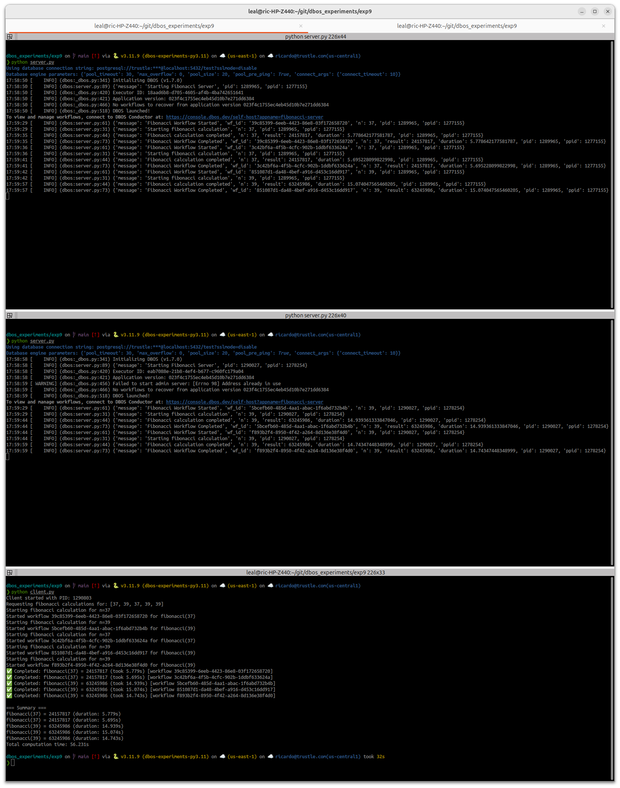

# DBOS Experiment 9 - Fibonacci Calculator

This experiment demonstrates a DBOS-based fibonacci calculator with client-server architecture.

## Architecture



## Files

- `server.py` - DBOS server that processes fibonacci calculations
- `client.py` - Client that enqueues fibonacci calculation requests
- `README.md` - This documentation file
- `image.png` - Architecture diagram

## Usage

1. Start the server:
   ```bash
   python server.py
   ```

2. In another terminal, run the client:
   ```bash
   python client.py
   ```

The client will generate random fibonacci numbers and show results as they complete.

## Features

- Asynchronous workflow processing
- Graceful shutdown with signal handling
- Real-time result display as workflows complete
- Comprehensive logging with process information
